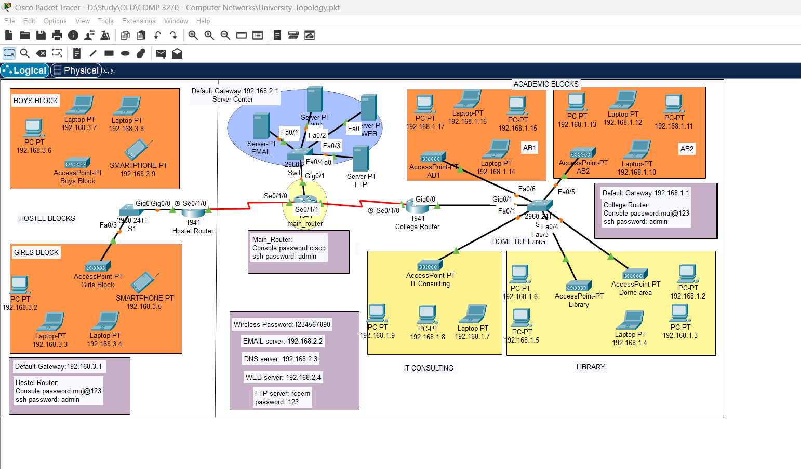

# University Network Topology

This repository contains the **University Network Topology** project, designed using Cisco Packet Tracer. The topology represents a comprehensive network infrastructure for a university, including various buildings and functionalities such as Wi-Fi, routers, and server configurations.

## About the Project

The **University Network Topology** is a visual representation of a university's network infrastructure. It is designed to:
- Simulate real-world networking scenarios for educational purposes.
- Showcase an organized network structure across multiple blocks (e.g., Boys Block, Girls Block, Academic Blocks, IT Consulting, Library).
- Demonstrate the use of routers, switches, access points, and servers in a network environment.

## Features
- **Network Segmentation**:
  - Separate VLANs for different areas such as Boys Block, Girls Block, Academic Blocks, Library, and IT Consulting.
- **Routers and Switches**:
  - Configured routers and switches to ensure proper communication across all subnets.
- **Access Points**:
  - Wireless connectivity for devices such as laptops and smartphones.
- **Servers**:
  - Centralized servers for email, DNS, FTP, and web hosting.
- **Security Configurations**:
  - Console and SSH passwords for routers and switches.
 
## Screenshots



## Network Details

### Blocks and Subnets
- **Boys Block**:
  - Devices: PCs, Laptops, Smartphones
  - Subnet: `192.168.3.x`
- **Girls Block**:
  - Devices: PCs, Laptops, Smartphones
  - Subnet: `192.168.3.x`
- **Academic Blocks (AB1 and AB2)**:
  - Devices: PCs, Laptops
  - Subnet: `192.168.1.x`
- **IT Consulting**:
  - Devices: PCs, Laptops
  - Subnet: `192.168.1.x`
- **Library**:
  - Devices: PCs, Laptops
  - Subnet: `192.168.1.x`

### Router and Switch Configuration
- **Main Router**:
  - Console Password: `cisco`
  - SSH Password: `admin`
- **Hostel Router**:
  - Console Password: `muj@123`
  - SSH Password: `admin`
- **College Router**:
  - Console Password: `muj@123`
  - SSH Password: `admin`

### Servers
- **Email Server**: `192.168.2.2`
- **DNS Server**: `192.168.2.3`
- **Web Server**: `192.168.2.4`
- **FTP Server**:
  - IP: `192.168.2.5`
  - Username: `recom`
  - Password: `123`

### Wireless Configuration
- **SSID**: Various access points for each block.
- **Password**: `1234567890`

## Tools and Technologies Used
- **Cisco Packet Tracer**:
  - Designed and simulated the network topology.
- **Routers and Switches**:
  - Configuration and implementation.
- **Servers**:
  - Integrated for handling DNS, email, web, and FTP functionalities.

## How to Open and Simulate
1. Install **Cisco Packet Tracer**.
2. Clone this repository:
   ```bash
   git clone https://github.com/<your-username>/University_Network_Topology.git
